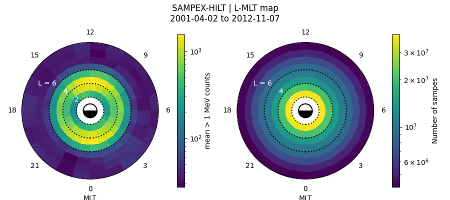

# Introduction
This package contains the software to create precipitation maps for the Space Precipitation and Impacts (SPI) ISFM project.


*Example of a SAMPEX-HILT precipitation map as a function of L and MLT.*

# Installation
To install as a developer run:

```bash
git clone git@github.com:mshumko/spi_precipitation_maps.git
cd spi_precipitation_maps
```

Then run  one of these (see comment in requirement.txt)
```bash
python3 -m pip install -e .
```
or 
```bash
python3 -m pip install -r requirements.txt 
```

# Producing Precipitation Maps
I wrote the `Bin_Data` class in the `spi_precipitation_maps/bin_data.py` module (you can import it as: `from spi_precipitation_maps.bin_data import Bin_Data`) that bins a precipitation variable (`precipitation_col`) in each `x_bin` and `y_bin`, each corresponding to the `x_col` and `y_col` data variables.

I designed `Bin_Data` with a narrow scope---it only bins the precipitation data. It does not know where the data lives, or how to load it. You must supply that information via the `instrument` argument to `Bin_Data`. 

Put simply, the class that you pass into the `instrument` arg must look like this:

```python
class My_Instrument:
    def __init__(self,):
        # Initialization steps for my instrument.
        return

    def __iter__(self):
        # This is the important method that Bin_Data calls. 
        # It must yield my data one day (or chunk) at a time.
        for date in dates:
            data = self.load_my_instrument_data(date, ...)
            yield data
    
    def load_my_instrument_data(date, ...):
        # Load my data and apply the necessary 
        # cleaning steps here.
        return data
```

Now you pass `My_Instrument` into `Bin_Data` via:

```python
L_bins = np.arange(2, 11)
MLT_bins = np.arange(0, 24.1)

m = Bin_Data(L_bins, MLT_bins, 'L_Shell', 'MLT', 'counts', My_Instrument)
m.bin()
m.save_map('test_l_mlt_map.csv')
```
The reason for the `My_Instrument` class is you can closely control what data it `yields` in `__iter__()`. This is useful, for example, for binning
- other variables,
- binning by storm phases,
- etc.

If this seems rather abstract, below I describe one such example (in a module).

## SAMPEX
The `spi_precipitation_maps/bin_sampex_hilt.py` example module bins the SAMPEX-HILT state4 data by L-Shell and MLT. It heavily utilizes the [sampex](https://sampex.readthedocs.io/en/latest/) package to load (and optionally download) the data for the HILT, PET, and LICA instruments.

You installed `sampex` as part of the above installation. If you downloaded the [SAMPEX data](https://izw1.caltech.edu/sampex/DataCenter/data.html) already, you need to tell `sampex` where to find it via the `python3 -m sampex config` command-line command. Otherwise, `sampex` will download the data as needed.

# Visualizing the Precipitation Maps
So far I added the L-MLT `Dial` plot visualization class. It is also called by `spi_precipitation_maps/bin_sampex_hilt.py`